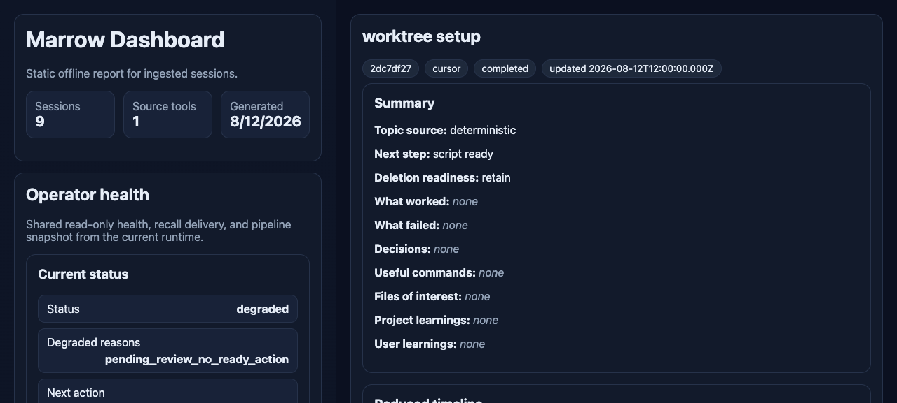
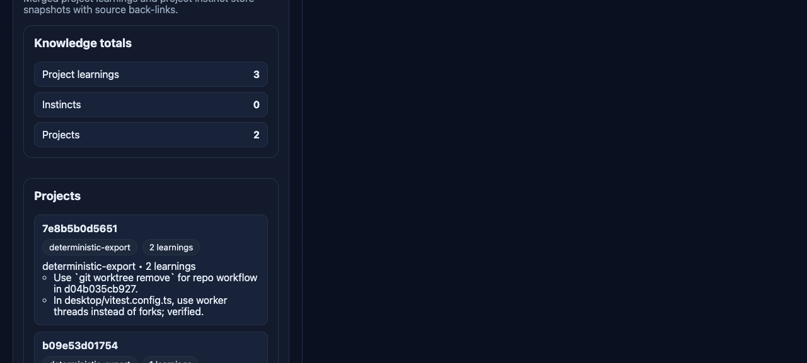

# Marrow

Turn AI coding-session transcripts into durable, searchable lessons.

[](https://github.com/dallascrilley/marrow/actions/workflows/ci.yml)
[](LICENSE)
[](https://nodejs.org)

Cursor, Claude Code, Codex CLI and friends each leave a pile of JSONL transcripts
on your disk. There is real knowledge in there, and none of it is reachable:
you cannot grep a month of sessions for the reason you switched a test runner to
worker threads. Marrow reads those transcripts, pulls out the parts worth
keeping, and files them where you can find them again.

It runs entirely on your machine, against files you already have.

## See it in 30 seconds

Nine transcripts in, three durable lessons out. This is a real run against
synthetic transcripts; the sandbox path prefix is shortened to `~`.

```console
$ marrow ingest backfill --source cursor
{ "discovered_count": 9, "processed_count": 9, "failed_count": 0, ... }

$ marrow export-index
Exported 9 session index records.
Export path: ~/index/session-index.jsonl

$ marrow search worktree
2dc7df27-6993-4113-9ad0-d27d5e2c2143	cursor	deterministic	@.cursor/worktrees.json develop a worktree setup script for this project
9c6686c3-7663-495b-bd35-8e31b5a231df	cursor	deterministic	help prune old/stale worktrees. check them for valuable code first that hasn't been merged
2 matches.
```

Each extracted lesson carries the evidence that produced it:

```json
{
  "learning_id": "d2d8b0e7-...:project:verified-fix:1",
  "kind": "workflow",
  "statement": "In desktop/vitest.config.ts, use worker threads instead of forks; verified.",
  "evidence": [
    "Summary of changes: ## Implemented **Vitest config** ... `pool: 'threads'` - use worker threads instead of forks ...",
    "Verification noted: ...All 92 tests pass, with about a 40% reduction in total duration."
  ],
  "confidence": "medium",
  "evidence_type": "verified",
  "source_refs": [
    { "session_id": "d2d8b0e7-...", "turn_id": "d2d8b0e7-...:turn-0001", "line": 13 }
  ]
}
```

The strings inside `evidence` are excerpts from the source transcript — the
"92 tests" and the timing belong to the session being mined, not to Marrow.
Marrow's own suite lives under `test/`.

`marrow report --html` writes a static dashboard over the same runtime:





## The one design decision worth stealing

Every stored lesson is traceable back to the exact transcript line that produced
it. `source_refs` records the source path, the content hash of the source file,
the session, the turn, the event and the line number, so any claim in the
knowledge store can be re-read against its origin. That is what makes the
corpus safe to delete sources from: a lesson with no reachable evidence is a
lesson Marrow refuses to promote.

The schema lives in [`src/models/canonical.ts`](src/models/canonical.ts) and the
gate that enforces it in
[`src/pipeline/extract.ts`](src/pipeline/extract.ts). The retention side is in
[`src/pipeline/archive.ts`](src/pipeline/archive.ts): a session only becomes a
deletion candidate once its durable artifacts exist on disk. In the run above,
six of nine sessions stayed blocked because Marrow could not find anything worth
keeping in them, which is the intended answer.

## Provenance

Marrow is original work in this repository: transcript adapters, ingest ledger,
extraction and archive pipelines, index/report/recall paths, and the capped MCP
surface. It is not a fork of Cursor, Claude Code, Codex, or any vendor memory
product. Those tools remain separate programs whose local transcripts Marrow
reads.

**What CI proves:** `script/cibuild` (install, lint, test, build) on a fixed
Node version, including a daily scheduled run for calendar-sensitive behavior.
**What is self-reported / machine-local:** value depends on your own transcript
corpora under `~/.cursor`, `~/.claude`, and similar paths; CI uses fixtures, not
your home directory.

## Requirements

- Node 22 or newer (see `engines` in [package.json](package.json)). On Node 22
  the CLI prints a one-line `ExperimentalWarning` for `node:sqlite`; Node 24+
  does not.
- Python `3.9+` for the parsed-intermediate cleanup helper
  ([`scripts/parsed-cleanup-fs.py`](scripts/parsed-cleanup-fs.py))
- Transcripts on local disk from at least one supported tool

No account, no network call, no API key is needed for the core pipeline. The
LLM-assisted commands are opt-in and described under [Optional LLM
steps](#optional-llm-steps).

## Install

```bash
git clone https://github.com/dallascrilley/marrow.git
cd marrow
npm install
npm run build
```

Run it directly:

```bash
node dist/cli.js --help
```

Or link the `marrow` binary into your shell:

```bash
npm link
marrow --help
```

## Quickstart

```bash
# 1. Read historical transcripts for one tool.
marrow ingest backfill --source cursor

# 2. Build the searchable index.
marrow export-index

# 3. Find a session by topic, session id or source tool.
marrow search worktree

# 4. See the whole corpus.
marrow report --html

# 5. Ask how a given result was derived.
marrow explain <session-id>
```

`marrow ingest sync --source cursor` picks up only new or changed transcripts,
which is the command worth putting on a schedule or a session-end hook.

## Supported sources

| Source | Flag | Where it reads |
|---|---|---|
| Cursor | `--source cursor` | `~/.cursor/projects/<workspace>/agent-transcripts/` |
| Claude Code | `--source claude-code` | `~/.claude/projects/<encoded-workspace>/<session>.jsonl` |
| Codex CLI | `--source codex-cli` | `~/.codex/sessions/<yyyy>/<mm>/<dd>/rollout-*.jsonl` and `~/.codex/archived_sessions/` |
| Kimi | `--source kimi` | `~/.kimi/sessions/<workspace-hash>/<session>/wire.jsonl` |
| Pi | `--source pi` | `~/.pi/agent/sessions/<encoded-cwd>/<iso>_<uuid>.jsonl` |

Adding a tool means writing an adapter under
[`src/adapters/`](src/adapters/): a discovery function, a transcript parser and
a workspace mapping. Each existing adapter is a worked example, and each has its
own fixture corpus under [`test/fixtures/`](test/fixtures/).

## Where things live

By default everything goes under `~/.marrow`:

| Path | Contents |
|---|---|
| `ledger/` | SQLite ledger: sessions, phases, deletion candidates |
| `staging/` | Parsed and reduced intermediates |
| `summaries/by-session/` | Per-session summary JSON and Markdown |
| `knowledge/projects/` | Extracted project lessons as JSONL |
| `knowledge/user/` | Extracted user-level lessons |
| `index/session-index.jsonl` | The searchable index |
| `reports/` | Archive receipts and the HTML dashboard |
| `deletes/` | Deletion candidates and receipts |
| `sources/` | Immutable provenance manifests for ingested transcripts |
| `cache/` | LLM response cache (appears after LLM commands) |

Set `MARROW_ROOT` to move the whole tree, and `MARROW_STAGING_ROOT` to put the
staging directory on a different filesystem. Both accept an absolute path.

## Configuration

| Variable | Purpose |
|---|---|
| `MARROW_ROOT` | Runtime root. Defaults to `~/.marrow`. |
| `MARROW_STAGING_ROOT` | Staging root, for keeping intermediates on another volume. |
| `OPENROUTER_API_KEY` | Only for the opt-in LLM commands. Source it from your own secret manager; never commit it. |

**Legacy env names.** The project was previously `agent-session-distillery` / `asd`.
Prefer `MARROW_*` names. Where both are set, `MARROW_*` wins. Compatibility still
honors selected `ASD_*` spellings (for example `ASD_VAULT_ROOT`,
`ASD_MAX_PROJECT_LEARNINGS`, `ASD_LLM_MAX_PER`, `ASD_LLM_MAX_USD`) and the old
`AGENT_SESSION_DISTILLERY_ROOT` / `AGENT_SESSION_DISTILLERY_STAGING_ROOT` pair when
the new variables are unset. See [CHANGELOG.md](CHANGELOG.md) for the full
rebrand map, including `.asd-project-key` → `.marrow-project-key`.

A repository can pin its own project identity by writing a
`.marrow-project-key` file at its root. Otherwise the project id comes from the
git origin remote, falling back to a hash of the workspace path
([ADR-0002](docs/decisions/0002-project-id.md)).

### Optional LLM steps

Summarization, extraction and search are deterministic and offline. A few
commands can additionally call a model through OpenRouter to review or judge
what was extracted:

```bash
export OPENROUTER_API_KEY="$(your-secret-manager-command)"

marrow quality review-learnings --model openrouter/auto
marrow workflow judge --limit 5 --max-usd 1/24h
marrow promote judge --dry-run
```

They are bounded by explicit budgets (`--max-per`, `--max-usd`), cache their
responses, and refuse to run when no key is present. `marrow doctor provider`
checks credential resolution and budget headroom without spending anything.

## Read back

Storing lessons is only half of it; they have to reach the next session.

- `marrow recall --cwd <project>` prints the curated memory for a project, sized
  for injection by a SessionStart hook. It fails open when there is no memory.
- `marrow mcp serve` exposes a capped query surface over stdio, and
  `marrow mcp install` registers it in `~/.claude.json`.
- `marrow readback check` reports whether that wiring is installed, missing or
  drifted, without changing anything.

See [ADR-0010](docs/decisions/0010-recall-read-back.md) for the contract and
[ADR-0005](docs/decisions/0005-mcp-surface.md) for why the MCP surface is capped.

## Non-goals

- **Not published to npm.** `package.json` is `"private": true` (source install
  only). Clone and build; there is no `npm install -g marrow` from a registry.
- **Not a hosted service.** There is no server, no account and no sync. One
  machine, one user, files on disk.
- **Not a chat UI.** The interfaces are a CLI, a static HTML report and an MCP
  server. There is no web app to run.
- **Not a transcript archive.** Marrow is built to make sources deletable, not
  to hold them forever. It stores what it extracted plus receipts.
- **Not universal.** It supports the tools listed above because those are the
  ones I use. Anything else needs an adapter.
- **Not an evaluation framework.** It does not score your agent, benchmark
  models or measure prompt quality.

## Honest boundaries

- Extraction is heuristic and deliberately conservative. It drops multi-sentence
  narration, caps lessons per session, and would rather store nothing than store
  chatter. Expect a large share of sessions to yield nothing, as in the run
  above.
- `marrow search` queries the session index by topic, session id and source
  tool. It is not full-text search over transcripts. Lessons themselves are
  reachable through the HTML report, the JSONL under `knowledge/`, and the MCP
  query surface (`search_instincts`, `instincts_for_file`, `recent_instincts`;
  project-scoped queries take `--project-id`).
- Confidence values are heuristic labels, not calibrated probabilities.
- Adapter coverage tracks the transcript formats these tools shipped when each
  adapter was written. Formats change; the fixture corpora under `test/fixtures/`
  are what pin current behavior.
- The Cursor fixtures under `test/fixtures/cursor/live-regression/` keep the
  shape of real transcripts because that shape is what the parser has to
  survive. Every identifier in them is synthetic.
- Cross-project promotion and the LLM judging paths are the newest parts and see
  the least mileage.

## Development

The repository follows the "scripts to rule them all" pattern:

```bash
script/setup      # install toolchain and dependencies
script/test       # run the suite
script/cibuild    # exactly what CI runs: install, lint, test, build
```

`script/cibuild` is the single source of truth for CI, so local and CI cannot
drift. CI also runs on a daily schedule, which is how date-sensitive behavior
gets caught between commits rather than months later.

Details of the architecture live in [`docs/`](docs/): decision records in
[`docs/decisions/`](docs/decisions/), format contracts in
[`docs/specs/`](docs/specs/), and end-to-end walkthroughs in
[`docs/recipes/`](docs/recipes/).

## Contributing

See [CONTRIBUTING.md](CONTRIBUTING.md). Security reports go through
[SECURITY.md](SECURITY.md).

## License

MIT. See [LICENSE](LICENSE).
